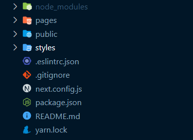
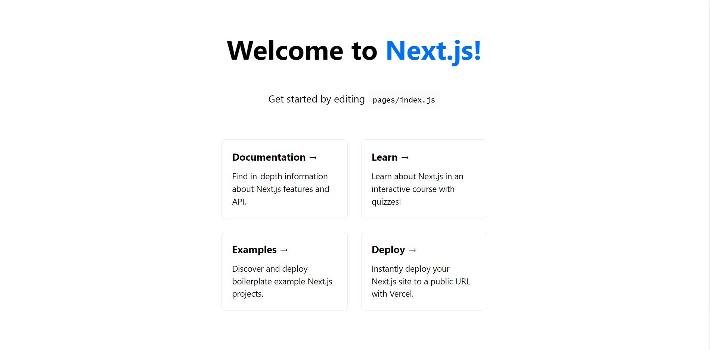
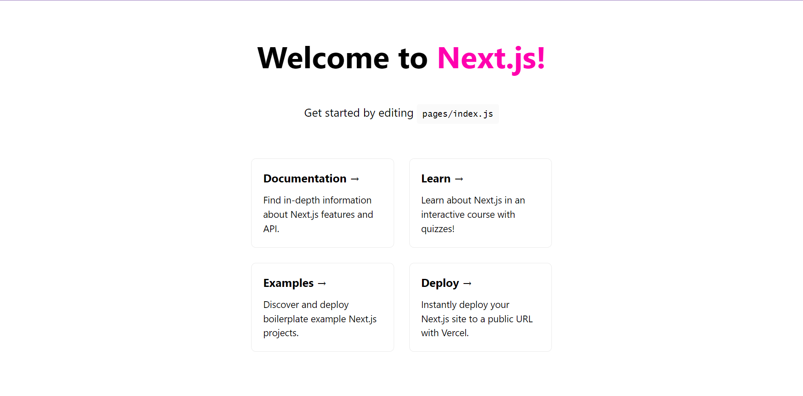

# Static Site Generation - Documentation
## About 

Next.js is a framework that makes it easy to create 'universal' React apps - React apps that do both client and server side rendering.

With Next.js, React pages are automatically rendered on both client and server side, without the hassle of setting up dependancies like webpack or babel and with automatic routing and without the constraints of projects like Create React App.

This is a starter project that provides an example of how to use Next.js with Dynamic URLS. This project exists to make it easier to get started a creating production app in React. You are invited to use it as a reference or to copy it and use it as a base for your own projects. Contributions to improve this project are welcome.

## Running locally in development mode

To get started, just clone the repository and run `npm install && npm run dev`:

    git clone https://github.com/MEOStudio/static-site-generator-demo.git
    npm install
    npm run dev

Note: If you are running on Windows run install --noptional flag (i.e. `npm install --no-optional`) which will skip installing fsevents.

## Building and deploying in production

If you wanted to run this site in production, you should install modules then build the site with `npm run build` and run it with `npm start`:

    npm install
    npm run build
    npm start

You should run `npm run build` again any time you make changes to the site.

Note: If you are already running a webserver on port 80 (e.g. Macs usually have the Apache webserver running on port 80) you can still start the example in production mode by passing a different port as an Environment Variable when starting (e.g. `PORT=3000 npm start`).

### Folder structure

To get started, create an empty folder and open a terminal, type
    
```jsx
npx create-next-app@latest my-project
```
    
The above command line creates a project named “my-project” and installs all the necessary libraries for a NextJS project
When opening the folder "my-project" with VSCode we see the directory tree as follows

Here's a folder structure for a NextJS project:



The meanings of the folders are as follows:
- node_modules: Where to store the libraries 
- pages: Where to store the code of the pages
- public: Contains the media files (images, videos, audio, ...) that we want to display on our website.
- styles: Where the CSS (or Sass) styling files of our pages are stored
- next.config.js: File contains information to adjust next, will be taught if there is time
- The rest of the files: system files

Using VSCode's terminal, we start our project up as follows:
    
```jsx
npm run dev
```
    
Our website will automatically run on the address [http://localhost:3000](http://localhost:3000/) as follows:



Now let's try to adjust a little! Similar to React, when we host a website with [localhost](http://localhost) using the built-in commands, we can adjust the styling without having to open the site again and again, Next will automatically update each time we save the source code.
- Start by changing the file styles/Home.module.css as follows on line 32:
    
    ```css
    .title a {
      color: #ff00ae;
      text-decoration: none;
    }
    ```
    
- Save the source code with Ctrl + S and look back at our website, we will see the word Next.js has now changed to pink! Wonderful!


